<h1 align="center">Renan De Cesare</h1>

Construo sistemas de automação em Python para operações financeiras, risco & compliance. 
Foco em pipelines de dados, auditoria automática e monitoramento de operações.

🐍 Python &nbsp;|&nbsp; 📊 Data &nbsp;|&nbsp; ⚙️ Automation

---

## 👋 Sobre mim

Trabalho no mercado financeiro (Middle Office / Risco & Compliance) e, ao longo dos últimos anos, me tornei a pessoa responsável por automações, dados e sistemas internos da área.

Crio pipelines, robôs e ferramentas internas para:
- Escalar processos operacionais
- Reduzir trabalho manual
- Aumentar controle, rastreabilidade e confiabilidade dos dados

---

## 🚀 Projetos em destaque

- 🔹 **[zendesk-ticket-exporter-pdf](https://github.com/renan-cesare/zendesk-ticket-exporter-pdf)** — Automação em Python para exportação em massa de tickets do Zendesk em PDF, com checkpoint, inventário e consolidação de evidências.
- 🔹 **[brokerage-notes-compliance-monitor](https://github.com/renan-cesare/brokerage-notes-compliance-monitor)** — Pipeline em Python para extração e consolidação de PDFs de notas de corretagem (B3), geração de histórico em Excel e aplicação de flags de compliance.
- 🔹 **[outlook-structured-operations-audit-automation](https://github.com/renan-cesare/outlook-structured-operations-audit-automation)** — Automação de auditorias via Outlook com rastreio por IDs, histórico em Excel e cobrança automática de respostas.
- 🔹 **[outlook-performance-audit-automation](https://github.com/renan-cesare/outlook-performance-audit-automation)** — Auditoria de performance de carteiras via Outlook + Excel (envio em massa, histórico e follow-up).

---

## 📊 Stack e atividade
<!-- 3) Profile Details (overview anual) -->

  

<!-- 1) GitHub Metrics (super dashboard) -->

  

<!-- 2) Snake (extra visual) -->

  

<!-- 4) Contribution Graph (tendência por dia) -->

  

---

## 📫 Contato

  
  

